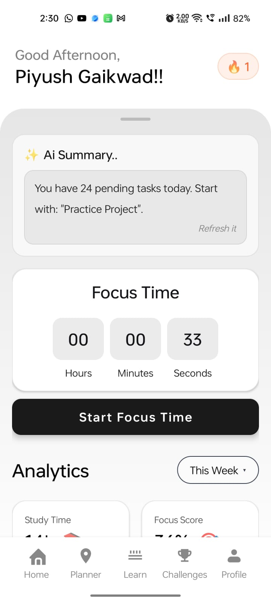
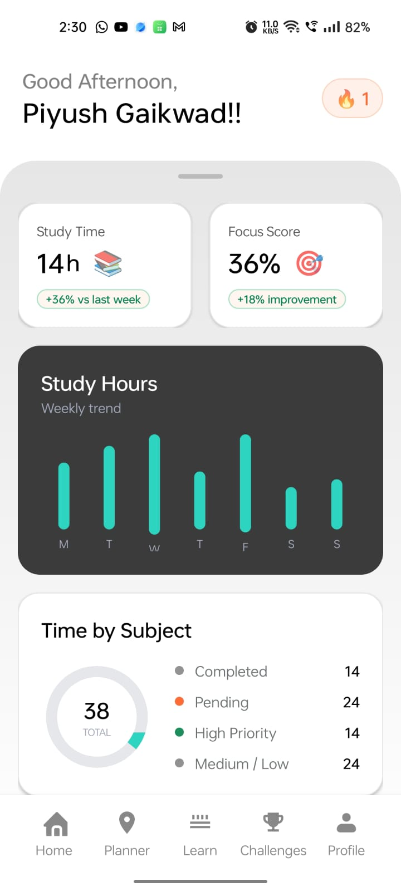
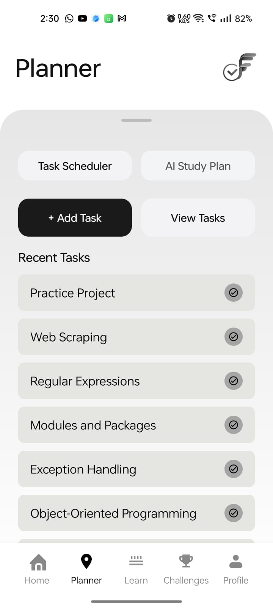
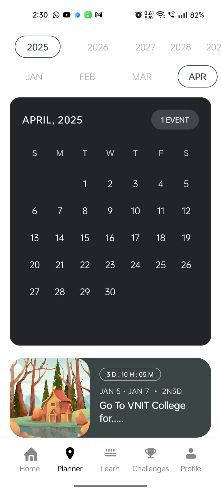
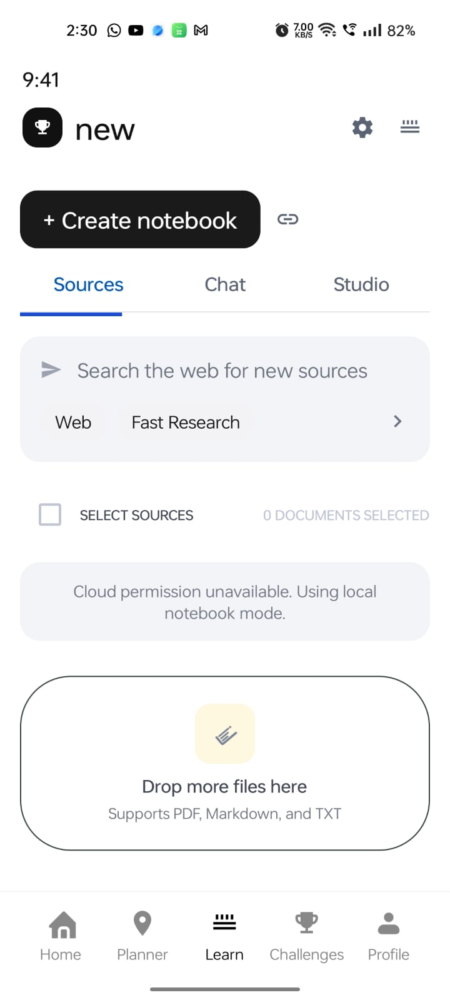
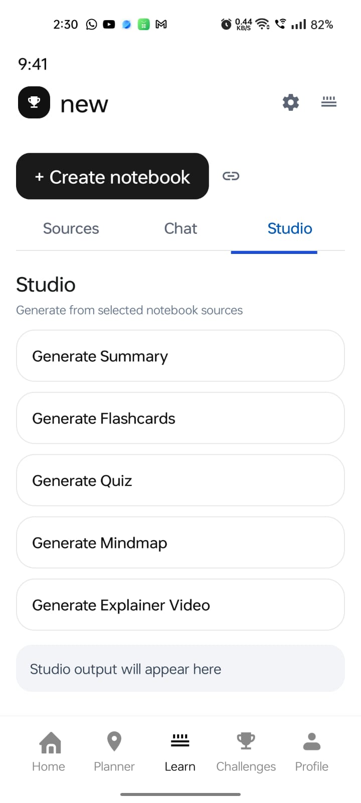
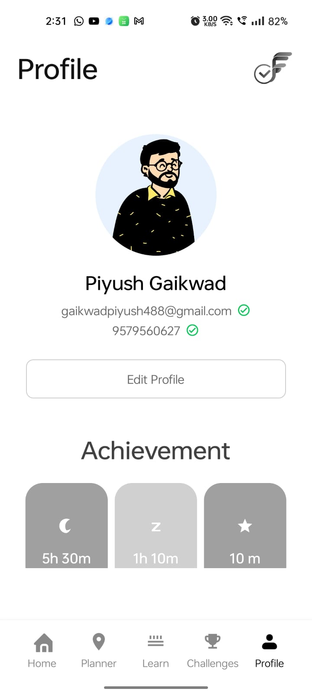
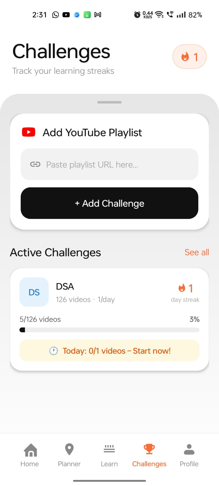
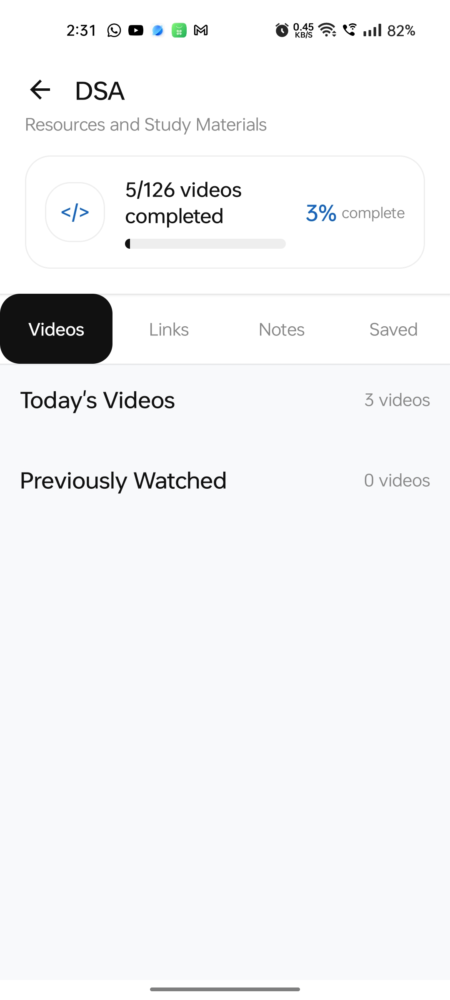

# Focus-Flow

Focus-Flow is an Android productivity and learning app that combines:

- study planning
- AI-powered content transformation
- retrieval-augmented Q&A (RAG)
- PDF-to-video explainers
- planner, reminders, streaks, and challenges

This repository is a multi-part workspace with one Android client (`app/`) and multiple AI backend services (`agents/` and `new-spaces-for-app/`).

## Repository Structure

```text
.
|- app/                         # Android app (Java, Firebase, Retrofit)
|- agents/
|  |- content-wizard/           # Unified content generation API
|  |- rag/                      # RAG ingestion + chat API
|  |- services/                 # Distributed content generation API
|  |- video-creation/           # PDF to explainer video API
|- new-spaces-for-app/
|  |- app.py                    # FastAPI study-plan generator (Groq)
|  |- backend/                  # Node.js study-plan service (xAI)
|- build.gradle                 # Root Gradle config
|- settings.gradle              # Android module inclusion
```

## Core Features

### Android App

- User onboarding and authentication (Firebase Auth + Google Sign-In)
- Dashboard, profile, planner, and schedule views
- Reminder notifications and alarm receiver integration
- Learning challenges and progress tracking
- AI integrations:
	- study-plan generation
	- RAG upload/chat
	- content wizard (report, quiz, flashcards, mindmap)
	- PDF-to-video generation

### AI Backends

- Study Plan API (`new-spaces-for-app/app.py`): generates structured day-wise study plans
- RAG API (`agents/rag`): supports PDF/text/URL ingestion and contextual chat
- Content Wizard APIs (`agents/content-wizard`, `agents/services`): generates educational artifacts
- Video Creation API (`agents/video-creation`): converts PDF content into narrated explainer videos

## App Screenshots

Below are app UI screenshots grouped by feature area. Images are loaded directly from `readmeimges/` based on file names.

### Splash Screen

`img1.png` (Splash screen)


### Dashboard Section

`dashbaord.png`



`dashboard2.png`



### AI Scheduler Section

`AI_Sheducle_planner.png`



`AI_Shedulce_generator.png`



### RAG Section

`RAG.png`



`Features_from_rag.png`



### Profile Section

`Profile.png`



### YouTube Playlist Tracker Section

`youtubeplaylist_tracker.png`



`youtube-playlist_interface.png`



## Tech Stack

- Android: Java, Android SDK 34, Retrofit, OkHttp, Firebase Auth, Firestore, FCM, Glide
- Python Services: FastAPI, Uvicorn, Hugging Face Hub, LangChain, FAISS, MoviePy, Edge-TTS
- Node Service: Express
- Deployment Style: Dockerized services (Hugging Face Spaces compatible)

## Android Configuration Snapshot

- `minSdk`: 24
- `targetSdk`: 34
- `compileSdk`: 34
- App ID: `com.sagar.app`

Default AI base URLs are currently configured in:

- `app/src/main/java/com/sagar/app/StudyApiService.java`

Configured endpoints:

- Study API: `https://piyush1225-new-spaces-for-app.hf.space/`
- RAG API: `https://piyush05-rag.hf.space/`
- Content Wizard API: `https://piyush05-services.hf.space/`
- Video API: `https://piyush05-video-creation.hf.space/`

## API Surface (High-Level)

### Study Plan API (`new-spaces-for-app/app.py`)

- `GET /health`
- `POST /generate-study-plan`

Expected input fields:

- `goal`
- `dailyMinutes`
- `days`
- `preset`

### RAG API (`agents/rag/app.py`)

- `GET /`
- `POST /upload/pdf`
- `POST /upload/text`
- `POST /upload/url`
- `POST /chat`

### Content Wizard (Distributed) API (`agents/services/app.py`)

- `GET /`
- `POST /generate/report`
- `POST /generate/flashcards`
- `POST /generate/quiz`
- `POST /generate/mindmap`
- `POST /generate/slides`
- `POST /generate/table`
- `POST /generate/infographic`
- `POST /generate/audio-script`
- `POST /generate/audio-file`

### Content Wizard (Unified) API (`agents/content-wizard/app.py`)

- `GET /`
- `POST /generate/all`
- `POST /generate/audio-file`

### Video Creation API (`agents/video-creation/app.py`)

- `GET /`
- `POST /generate-video/`

## Environment Variables

Set only what the target service needs:

- `HF_TOKEN`: required by Hugging Face powered generators (`agents/content-wizard`, `agents/services`, `agents/rag`, `agents/video-creation`)
- `GROQ_API_KEY`: required by `new-spaces-for-app/app.py`
- `XAI_API_KEY`: required by `new-spaces-for-app/backend/server.js`
- `PORT`: optional for local port override in selected services

## Local Development Setup

### 1) Android App

Prerequisites:

- Android Studio (latest stable)
- JDK 8+ compatible with Android Gradle plugin used in project
- valid `app/google-services.json`

Build and run:

```bash
./gradlew assembleDebug
```

Windows PowerShell:

```powershell
.\gradlew.bat assembleDebug
```

Install on device/emulator from Android Studio, or via:

```bash
./gradlew installDebug
```

### 2) Python Services

Run each service in its own terminal and virtual environment.

Generic pattern:

```bash
cd <service-folder>
python -m venv .venv
source .venv/bin/activate
pip install -r requirements.txt
uvicorn app:app --host 0.0.0.0 --port 7860
```

Windows PowerShell activation:

```powershell
.\.venv\Scripts\Activate.ps1
```

Recommended local ports to avoid collisions:

- Study API: `8001`
- RAG API: `8002`
- Content Wizard API: `8003`
- Video API: `8004`

If you run services on custom local ports, update base URLs in:

- `app/src/main/java/com/sagar/app/StudyApiService.java`

### 3) Node Backend (Optional)

```bash
cd new-spaces-for-app/backend
npm install
XAI_API_KEY=<your_key> node server.js
```

Default port: `3003`

## Docker Deployment

Each Python service in `agents/` contains a Dockerfile suitable for container deployment and Hugging Face Spaces.

Typical build/run:

```bash
docker build -t focusflow-rag ./agents/rag
docker run --rm -p 7860:7860 -e HF_TOKEN=$HF_TOKEN focusflow-rag
```

Repeat similarly for other services by changing folder and required environment variables.

## Key Integration Files

- Android API wiring: `app/src/main/java/com/sagar/app/StudyApiService.java`
- Android API contracts:
	- `app/src/main/java/com/sagar/app/StudyApi.java`
	- `app/src/main/java/com/sagar/app/RagApi.java`
	- `app/src/main/java/com/sagar/app/ContentWizardApi.java`
	- `app/src/main/java/com/sagar/app/VideoCreationApi.java`
- Android app manifest: `app/src/main/AndroidManifest.xml`

## Common Issues and Fixes

- `HF_TOKEN missing in environment variables`
	- Set `HF_TOKEN` before starting HF-backed services.

- Android requests fail with timeout
	- Check service availability and base URLs in `StudyApiService.java`.
	- Adjust timeouts if needed for heavy generation endpoints.

- Port already in use
	- Start each backend on a unique local port.

- Firebase login or notification issues
	- Verify `google-services.json` is valid and matches your Firebase project.

- Video generation fails locally
	- Ensure system dependencies (for MoviePy/FFmpeg) are installed.

## Development Notes

- The repo currently includes both FastAPI and Node implementations for study-plan generation.
- Android is currently wired to the FastAPI/HF Spaces style URLs through Retrofit.
- Service READMEs under some subfolders are minimal metadata stubs; this root README is intended as the primary project guide.

## Suggested Next Improvements

- Add a `docker-compose.yml` for one-command local multi-service startup.
- Move base URLs to Android `BuildConfig` or remote config for easier environment switching.
- Add unit and integration tests for critical API contracts.
- Add CI checks for Android build + Python lint/test pipelines.

## License

No explicit repository-wide license file is currently present. Add a `LICENSE` file to define usage terms.